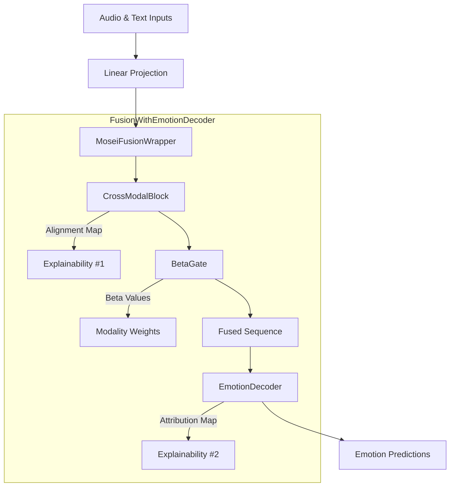

# HRI-EMO: Adaptive Unified Multimodal Emotion Recognition

**HRI-EMO** is a robust and interpretable framework for multimodal emotion recognition (Audio + Text). It combines an adaptive cross-modal fusion mechanism with a query-based emotion decoder to achieve state-of-the-art performance on the **CMU-MOSEI** dataset while providing deep explainability.

> **Key Feature:** Unlike black-box models, HRI-EMO tells you *why* it predicts an emotion by visualizing cross-modal alignment and emotion-specific attention.

---

## 🌟 Key Features

* **Adaptive Fusion (β-Gating)**: A vector-wise gating mechanism that dynamically weights Audio vs. Text modalities based on signal reliability.
* **Dual-Level Interpretability**:
    1.  **Encoder Level**: Visualizes Audio-Text alignment (which audio frames align with which words).
    2.  **Decoder Level**: Visualizes Emotion Attribution (which part of the sequence triggered a specific emotion like "Happy" or "Fear").
* **Robustness**: Optimized "v2" architecture (Simplified Fusion + High Dropout) prevents overfitting on noisy datasets like MOSEI.
* **Unified Framework**: Modular design supporting both Sequence-level and Utterance-level features.

---

## 🏗️ Architecture

<!-- # An Adaptive Framework for Multimodal Emotion Understanding in Human–Robot Interaction
We propose a multimodal emotion understanding framework based on an adaptive cross-modal fusion mechanism integrated with an emotion-level Transformer decoder.
The framework is designed to achieve both robust multimodal representation learning and fine-grained emotion interpretability for Human–Robot Interaction (HRI) tasks.

## 1. Transfer Learning for Feature Representation
Based on transfer learning, we first extract deep contextual representations from both modalities using large pretrained models:

$$
h_\text{text} = \text{Pool}\big(\text{BERT}(\text{Tokenizer}(x_\text{text}))\big)
\quad\in\mathbb{R}^{d_t}
$$

$$
h_\text{audio} = \text{MeanPool}\big(\text{WavLM}(\text{FeatureExtractor}(x_\text{audio}))\big)
\quad\in\mathbb{R}^{d_a}
$$

These embeddings capture semantic, syntactic, and acoustic-prosodic information, respectively.

## 2. Adaptive Cross-Modal Fusion

To achieve semantic alignment and dynamic weighting across modalities,  
we adopt a Transformer-based cross-modal encoder combined with a  vector-wise adaptive gating mechanism.

1. **Cross-Modal Transformer — semantic alignment & redundancy reduction**

Each modality first passes through an *intra-modal self-attention* layer  
to filter redundant information, followed by *bidirectional cross-attention*  
to exchange context:

$$
\tilde{h}_a, \tilde{h}_t = \text{CrossModalTransformer}(h_a, h_t)
$$

Residual connections and LayerNorm are applied after every attention and  
feed-forward block to ensure stability.

2. **Vector-wise β-Gating — fine-grained adaptive fusion**

Instead of a single scalar gate, the model predicts a *per-dimension* weight vector $\mathbf{β}\in[0,1]^d$ that controls the contribution of each feature dimension from audio and text:

$$
h_{\text{fusion}} = \mathbf{β}\odot\tilde{h}_a + (1-\mathbf{β})\odot\tilde{h}_t
$$

where $\odot$ denotes element-wise multiplication.  
Each component $β_j$ adaptively balances the $j$-th semantic dimension, allowing some latent features to rely more on acoustic cues while others emphasize linguistic information. A mean-pooled β-value is logged for interpretability.

This design—TACFN-style intra + cross attention + vector gating—enhances:
- **Robustness**, by dynamically down-weighting noisy modalities per feature.
- **Explainability**, by revealing modality preference across feature dimensions.

## 3. Emotion-Level Transformer Decoder
Subsequently, an emotion-level Transformer decoder is introduced.
Each emotion query vector 𝑞_𝑖 interacts with the fused representation to extract emotion-oriented contextual information:

$$
z_i = \text{DecoderBlock}(q_i, h_{\text{fusion}})
$$

The resulting vectors $\{z_i\}_{i=1}^{N_e}$ correspond to different emotion categories (e.g., happiness, sadness, anger).
This architecture enables:
- Adaptive fusion at the modality level (via β-gating)
- Fine-grained interpretability at the emotion level (via query-based decoding)

## 4. Model Objective
For multi-label emotion recognition, the decoder outputs are fed into independent classifiers:

$$
\hat{y}_i = \sigma(W_i z_i + b_i)
$$

and the model is optimized using binary cross-entropy loss:

$$
L = - \sum_i [y_i \log \hat{y}_i + (1 - y_i) \log(1 - \hat{y}_i)]
$$

## Dataset and Evaluation
Consistent with prior studies, the IEMOCAP dataset is used for training, validation, and testing.
This dataset provides synchronized speech–text pairs annotated across multiple emotion dimensions, making it ideal for multimodal emotion modeling and interpretability studies.

## Summary
In summary, the proposed framework combines adaptive β-gating fusion with an emotion-level decoder, simultaneously achieving:

- Robustness at the modality layer (through dynamic weighting and semantic alignment)

- Interpretability at the emotion layer (through emotion query-based decoding)

This dual-level adaptivity maintains computational efficiency while enhancing the model’s discriminative power and transparency in multi-label emotion recognition. -->
